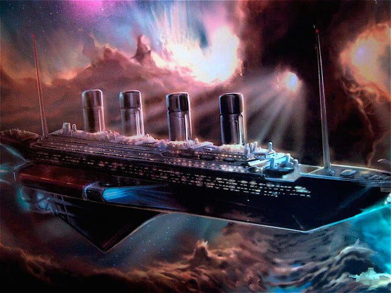

## 🚀🌌 Zainspiruj nas swoimi umiejętnościami analizy danych! 🚀🌌

### Czy marzyłeś kiedyś o podróży na pokładzie statku kosmicznego? 

🚢Nieważne, czy jesteś pasjonatem nauk przyrodniczych czy wielbicielem filmów sci-fi - mamy dla Ciebie wyjątkowe zadanie rekrutacyjne do naszego koła! 📊📈 Twoim zadaniem jest eksploracja, analiza i wyciągnięcie cennych wniosków ze zbioru danych "Spaceship Titanic".  🛸🌠 Musisz odkryć jak najwięcej ciekawych statystyk oraz relacji między cechami pasażerów. Wszystko należy również zwizualizować na wykresach, aby jeszcze lepiej oddać ich charakter, a następnie przekonująco zaprezentować i uzasadnić swoje wnioski. 💡📊

Ale to nie koniec! Jeśli zaciekawisz się jeszcze bardziej i masz ochotę szerzej wykorzystać swoją analizę, mile widziane będzie stworzenie modelu machine learningowego przewidującego, czy dany pasażer został przetransportowany do innego wymiaru. 🤖🌌

####  To doskonała okazja, aby wykorzystać swoje umiejętności analityczne, kreatywność i zdolności prezentacyjne. Zapnijcie pasy i wyruszcie z nami w podróż w głąb kosmicznej otchłani! 🚀🌌

## Jak udostępnić rozwiązanie?

1. Zrób forka tego repozytorium
2. Dodaj wszystkie pliki wchodzące w skład rozwiązania do odpowiedniego folderu `spaceship_titanic/rozwiazania/<imie>_<nazwisko>/`
3. Stwórz nowego Pull Requesta z twojego forka do tego repozytorium

---

## 🚀🌌 Inspire us with your data analysis skills! 🚀🌌
### Have you ever dreamed of traveling aboard a spaceship?

🚢Whether you are passionate about life sciences or a fan of sci-fi movies, we have a unique recruitment task for you to join our club! 📊📈 Your task is to explore, analyze and draw valuable conclusions from the "Spaceship Titanic" dataset. 🛸🌠 You need to discover as many interesting statistics and relationships between passenger characteristics as possible. You also need to visualize everything in graphs to further illustrate their nature, and then convincingly present and justify your conclusions. 💡📊

But it doesn't stop there! If you get even more curious and feel like using your analysis more broadly, a machine learning model predicting whether or not a particular passenger has been transported to another dimension would be welcome. 🤖🌌

This is a great opportunity to use your analytical skills, creativity and presentation skills. Fasten your seatbelts and embark with us on a journey into the depths of the cosmic abyss! 🚀🌌
How to share the solution?

1. Make a fork of this repository
2. Add all files included in the solution to the appropriate folder: `spaceship_titanic/rozwiazania/<name>_<surname>/`
3. Create a new Pull Request from your fork to this repository
