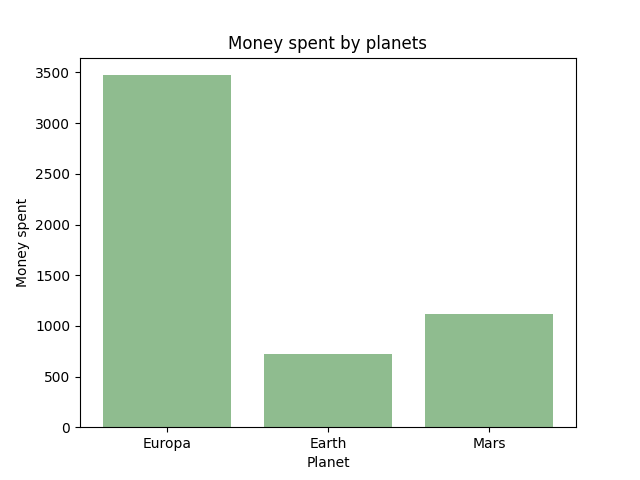
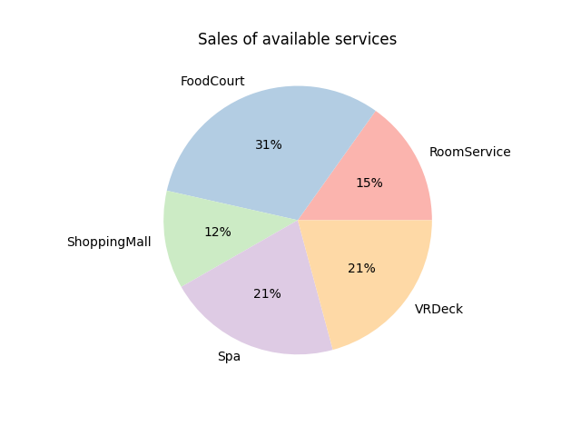

# Oczyszczanie i uzupełnianie danych
Pośród danych zawarte są osoby z wiekiem równym 0. Potraktujemy je jako osoby nienarodzone i jako, ze nie dodają one istotnych informacji, pominiemy je w analizie. Dodatkowo ze względu na ich małą ilość pominiemy pasazerow, którym brakuje numeru kabiny. Pozostałe brakujące dane uzupełniamy na podstawie danych w odpowiadających im kolumnach/wierszach. 
# Analiza
Podczas analizy skupię się głównie na badaniu, którzy pasazerowie najchętniej kupują dodatkowe usługi w trakcie rejsu, tym samym zwiększając zyski przewoźnika. 
### Średnia ilość wydanych pieniędzy w zaleznosci od wieku
\
Na wykresie mozemy zaobserwować, ze najmniej pieniędzy w trakcie podrózy wydają pasazerowie ponizej 25 roku zycia. Mozemy więc wnioskować, ze majątki starszych pasazerow są większe niz młodszych, zatem starsi pasazerowie są bardziej wartościowymi klientami, przy załozeniu, ze dostępne na statku usługi nie generują strat.  
### Średnia ilość wydanych pieniędzy w zalezności od planety pochodzenia
\
Na wykresie mozemy zaobserwować, ze pasazerowie z planety Europa średnio wydają znacznie więcej pieniędzy na dostępne usługi niz pasazerowie z innych planet, więc są oni najbardziej wartościowymi klientami. Dodatkowo, na podstawie danych poprzedniego wykresu mozemy się domyślać, ze średnia wieku mieszkańców planety Europa jest wyzsza niz na innych planetach. 
### Porównanie pasazerow zwykłych z pasazerami VIP
\
Widzimy, ze pasazerowie VIP średnio wydają znacznie więcej niz zwykli pasazerowie, więc by maksymalizować zyski przewoźnik powinien maksymalizować liczbę pasazerow VIP na statku. 
### Udział poszczególnych usług w sprzedazy
\
Największy zysk generuje zdecydowanie FoodCourt, za nim znajduje się VRDeck wraz ze Spa, a na końcu RoomService i ShoppingMall. W związku z tym, przewoźnik powinien zastanowić się nad ulepszeniem dwóch ostatnich usług, poniewaz nie cieszą się one zbyt duzą popularnością. 
### Zainteresowanie poszczególnymi usługami w zaleznosci od wieku
\
Wykres pokazuje, pasazerowie do około 25 roku zycia są tak samo mało zainteresowani kazdą z dostępnych usług. Dodatkowo widać, ze ShoppingMall i RoomService cieszą się nieco większą popularnością wśród pasazerow powyzej 70 roku zycia, więc obie te usługi potrzebują ulepszeń nakierowanych na grupę wiekową 30-70. 